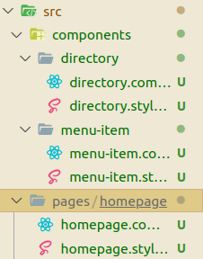

# 4-6. Master Project

Created: January 26, 2022 10:46 PM

# Setting Up E-commerce Project

## CRA Template and SASS installation

Using **create-react-app,** we will setup our our project called crwn-clothing. Next we have to add `node-sass` . 

**Create React App** comes with the configuration of the **sass**.

```bash
npm add node-sass
```

**Problem :**  A bug might occur where the **cra** webpack and babel configurations of the **sass** uses different version than the version installed in **node-sass** installation. 

**Solution :** Remove the **package.lock.json** file and the **node modules** file. Then run `npm install` and the problem solved.

## Components

We will create two folders **components** and **pages.** 

Components folder will store the **reusable component** while pages folder will store **single use components**.

Next, we will add a new **homepage component jsx** file and **homepage.style.scss** file in the **pages folder.**

Now in the **components folder** make this folder structure.



We added two new component, **MenuItem** and **Directory.** Each component has a jsx and scss file.

**Directory** is a class component because it need to maintain a **state** which is each menu item **title, imageUrl** and some other things.

```jsx
constructor() {
        super();
        this.state = {
            sections : [
                {
                    title: 'hats',
                    imageUrl: 'https://i.ibb.co/cvpntL1/hats.png',
                    id: 1,
                    linkUrl: 'shop/hats'
                  },
                  {
                    title: 'jackets',
                    imageUrl: 'https://i.ibb.co/px2tCc3/jackets.png',
                    id: 2,
                    linkUrl: 'shop/jackets'
                  },
                  {
                    title: 'sneakers',
                    imageUrl: 'https://i.ibb.co/0jqHpnp/sneakers.png',
                    id: 3,
                    linkUrl: 'shop/sneakers'
                  },
                  {
                    title: 'womens',
                    imageUrl: 'https://i.ibb.co/GCCdy8t/womens.png',
                    size: 'large',
                    id: 4,
                    linkUrl: 'shop/womens'
                  },
                  {
                    title: 'mens',
                    imageUrl: 'https://i.ibb.co/R70vBrQ/men.png',
                    size: 'large',
                    id: 5,
                    linkUrl: 'shop/mens'
                  }
            ]
        }
    }
```

```jsx
render() {
        return (
            <div className="directory-menu">
                {
                    this.state.sections.map(({title, imageUrl, id, size}) => {
                        return <MenuItem title={title} key={id} imageUrl={imageUrl} size={size}></MenuItem>;
                    })
                }
            </div>
        )
    }
```

Notice the **size** attribute will be undefined in first 3 MenuItem. And **large** on rest two. This is done because there is a **large** **class** to stand out these two components by making large in size.

**MenuItem** is functional component because no state is need to maintained. 

```jsx
const MenuItem = ({ title, imageUrl, size }) => (
  <div className={`menu-item ${size}`}>
    <div
      className="background-image"
      style={{
        backgroundImage: `url(${imageUrl})`,
      }}
    />
    <div className="content">
      <h1 className="title"> {title.toUpperCase()}</h1>
      <span className="subtitle">Shop Now</span>
    </div>
  </div>
);
```

Tags in this component according to how it will be styled. So i am skipping this explanation.

Now, **Homepage** is a very simple functional component just having a single directory component. And **App.js** in turn calling the **Homepage** component and **index.js** in turn calling the app.js

---

# React Router and Routing

We need to use the react router of version 5 ( however React router is updated to version 6 )

```bash
npm install react-router@5.0.0
```

**But I am using React Router version 6.**

## Routing in React

Instead of Thing what to render, React give power to our severs to **send data and make API requests.** And this server can be used on **mobile app or web app** both.

React is just a **UI library**, so we will use **React Router** to route to different pages. **Routing** is required when we have multiple pages.

React-router library is most popular and most supportive library.

```bash
npm install react-router-dom
```

Notice we installed **react-router-dom** because this is router specified for **web** while there is a **react-router-native** which is made for **react-native**. 

However we can still use **react-router** which can be used in both cases directly.

<aside>
💡 In case of any conflict of version of any package ( due to cra ), we can set a `resolution` property in our **package.json** file. And hard code the version of that particular package which was getting conflicted.

</aside>

## Initialising the React Router and Routing

Inside the **index.js,** call the react router main function which is  `Browser Router` . And the **App component** calling inside this component.

```jsx
import { BrowserRouter } from 'react-router-dom';
ReactDom.render(
	<BrowserRouter>
		<App />
	</BrowserRouter>
);
```

Lets Look at a example, how ***react-router*** works.

Lets create a dummy **HatPage function component** inside the App.js

```jsx
const HatPage = () => {
  return (
    <div>
      <h1>Hats Page</h1>
    </div>
  );
};
```

Now **import** the `Route` and `Routes` ********from **react-router-dom.**

Finally we can route the path inside our App Component.

```jsx
function App() {
  return (
    <div>
      <Routes>
        <Route path="/" element={ <Homepage/> } />
        <Route path="/hats" element={ <HatPage/> } />
      </Routes>
    </div>
  );
}
```

## Link

React Router gives us a advanced version of **link** tag. Remember react is a SPA so **Link** just re-render everything.

Example:

```jsx
import { Link } from 'react-router-dom';
const DemoCom = props => {
return (
	<div>
		<Link to='/topics'> Topics </Link>
	</div>
);
};
```

Also, a special function is introduced `useNavigate` to route through **buttons** or **forms.** 

```jsx
<NewInvoiceForm
    onSubmit={async event => {
      let newInvoice = await createInvoice(
        event.target
      );
    navigate(`/invoices/${newInvoice.id}`);
}}
```

## Url Parameters

We can pass and access **URL** parameters in react router using the syntax `:style` .

And can access them using a special function, react-router provides us, `useParams()` .

```jsx
import { Routes, Route, useParams } from "react-router-dom";

function App() {
  return (
    <Routes>
      <Route
        path="invoices/:invoiceId"
        element={<Invoice />}
      />
    </Routes>
  );
}

function Invoice() {
  let params = useParams();
  return <h1>Invoice {params.invoiceId}</h1>;
}

```

**Note** : we cannot access url parameters using props ( from v6 ). For more search on google and stackoverflow.

Apart from this there are a number of other functions, hooks available in **React Router**. Ex. useLocation(), matchPath(), etc. We can access them going their official documentation. 

---

# Forms and Component

## Shop Page

We will code our **shop page** in this section. This will be a class component containing the **SHOP_DATA**. ( Since this is big data file so will create a **shop.data.js** and move the **shop data** to this file and export it. 

For now, shop page **state** will be this shop data.

And finally we will render and map each collection from the state to  a new component **Collection Preview.**

Collection preview will be a **functional component.** This will return a single div, “**collection-preview**” and inside that a **h1** and our actual preview.

```jsx
<div className="preview">
      {
          items
          .filter((item, idx) => idx < 4)
          .map(item => (
              <div key={item.key}>{item.name}</div>
          ))
      }
 </div>
```

This is just a temporary code for preview div. Further the inside **div** will be replaced by a **collection item** component.

**Note** : We are first **filtering** our item upto **index less than 4** and then mapping **items** into each **item** which will be further passed into a new component.

```jsx
<CollectionItem key={item.id} item={item}/>
```

This code will replace the above div.

```jsx
const CollectionItem = ({ id, item }) => {
    const { name, imageUrl, price } = item;
    return <div className="collection-item" >
        <div 
            className="image"
            style = {{
                backgroundImage : `url(${imageUrl})`
            }}
        />
        <div className="collection-footer">
            <span className="name">
                {name}
            </span>
            <span className="price">
                {price}
            </span>
        </div>
    </div>
}
```

**Note:** Destructuring done above can be done in multiple ways.

## Header

We will now add our **header** component. But before that lets us create a **asset** in **src** folder and add the **crown.svg** .

CRA provides us a special **ReactComponent** to render any **image.** 

```jsx
import { ReactComponent as Logo } from '../..assets/crown.svg';
```

Now look at its implementation in **Header** component itself.

```jsx
const Header = () => {
    return (
        <div className="header">
            <Link className="logo-container" to='/'>
                <Logo className="logo"/>
            </Link>
            <div className="options">
                <Link className="option" to='/shop'>SHOP</Link>
                <Link className="option" to='/shop'>CONTACT</Link>
            </div>
        </div>
    )
}
```

Notice how we added a **Logo** tag and also notice that we are using the special **Link** component provided by **react router dom**.

Now there is one challenge, **How to route this header file** because it will always be present at our page, no matter what **path** is chosen.

Using **react router version 6** :

```jsx
function App() {
  return (
    <div>
      <Routes>
        <Route path="/*" element={ <Header/>} />
      </Routes>
      <Routes>
        <Route path="/" element={ <Homepage/> } />
        <Route path="/shop" element={ <ShopPage/> } />
        <Route path="/*" element={ <Error/>}/>
      </Routes>
    </div>
  );
}
```

I used an extra **routes** component and routing to `/*` , which means any path after **/** ( slash ) .

Also Notice that I had included a **Error** route for any path which is not specified. And **Error** is a simple functional component created by **myself** inside the **app.js** itself.

## Forms in React

In this module we will focus on reusing components and that’s what component are meant for.

First we will create a **Sign Up and Sign In Page** will hold our **Sign In** and **Sign Up** Component. This page is a simple functional component which will call our **SignIN** component ( for now ).

```jsx
const SignInAndSignUpPage = () => {
    return (
        <div><SignIN/></div>
    )
}
export default SignInAndSignUpPage;
```

**Sign In** will be a class component which will store a state.

```jsx
this.state = {
  email: "",
  password: "",
};
```

Along with, this component stores two event handlers.

```jsx
handleSubmit = (e) => {
  e.preventDefault();
  this.setState({ email: "", password: "" });
};
handleChange = (e) => {
  const { value, name } = e.target;
  this.setState({ [name]: value });
};
```

We used **handleSubmit** in our form **onSubmit event** and **handleChange** inside our input component.

Notice → `{ [ name ] : value }` , In this syntax We are **dynamically** updating our **state**. 

**[ name ]** will refer to the key and set it to the **value** passed.

Now lets look where these event handlers are going to be used in action.

```jsx
render() {
    return (
      <div className="sign-in">
        <h2>I already have an account</h2>
        <span>Sign in with your email and password</span>

        <form onSubmit={this.handleSubmit}>
          <FormInput
            type="email"
            name="email"
            value={this.state.email} 
            handleChange={this.handleChange}
            label = "email"
            required />
          <FormInput 
            type="password" 
            value={this.state.password} 
            name="password" 
            handleChange={this.handleChange}
            label="password"
            required
            />
          <CustomButton type="submit" value="Submit Form">
            Sign In
          </CustomButton>
        </form>
      </div>
    );
  }
```

This is our big **render function** which mainly contains a form which in turn contains two new component, **FormInput** and **CustomButton**

Lets look at these two new component.

First, **FormInput →** This is modified Input which perform the same task but have extra features. Biggest one is that **It is reusable** and we will use at multiple places. Also it contains some special code for **label microinteraction.**

```jsx
const FormInput = ({handleChange, label, ...otherProps}) => {
    return (
        <div className="group">
            <input className="form-input" onChange={handleChange} {...otherProps} />
            {
                label ?
                (<label className={`${otherProps.value.length ? 'shrink' : ''} form-input-label`}>
                    {label}
                </label>)
                : null 
            }
        </div>
    )
}
```

Now second one, **CustomButton** component → 

```jsx
const CustomButton = ({children, ...otherProps}) => {
    return (<button className="custom-button" {...otherProps}>
        {children}
    </button>)
}
```

**Note :- `children`** is a special prop which hold whats inside the Component like **innerHtml.**