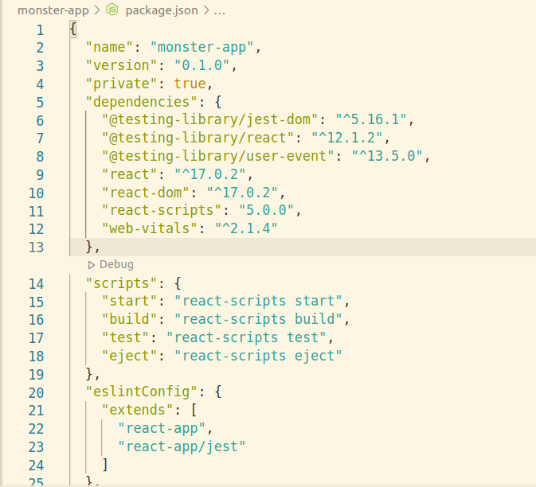
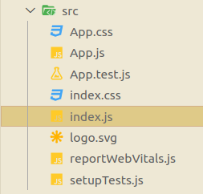
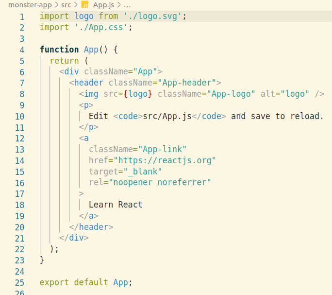

# 3. React basics - Part 1

Created: January 20, 2022 10:07 PM

## Setting the Environment 🏞️

First we have to install node and npm ( 5.2+ which supports `npx`).

Create React App is the comfortable environment for learning react.

**NPM vs NPX**

npm is used for installing and saving the modules either locally or globally. But there are some modules which **we want to be updated everytime we use it.** 

npx does this work by installing the package ( here `create-react app` ) then use it and then deletes it. In this way everytime we use create-react-app, we are using the updated version.

**Create-react-app** → This install many packages in advance and some important scripts.



1. **npm start →** Script to start the demo app
2. **npm build →** This creates an optimum ( single lining all the code ) for maximum efficiency and run time.
    
    Configuration for `webpack` and `babel` is done by the engineers at **Facebook.**
    
3. **npm test** → Used for testing purpose.
4. **npm eject** → In case we want our own config for webpack or babel or some other config. Then we can use this.

---

## Understanding the source 📙

**Lets Look what is within src folder**



A screenshot of what we get in source of create-react-app

**react and react-dom** are used for this app.

Entire code of **index.js,**

```jsx
import React from 'react';
import ReactDOM from 'react-dom';
import './index.css';
import App from './App';
import reportWebVitals from './reportWebVitals';

ReactDOM.render(
  <React.StrictMode>
    <App />
  </React.StrictMode>,
  document.getElementById('root')
);

// If you want to start measuring performance in your app, pass a function
// to log results (for example: reportWebVitals(console.log))
// or send to an analytics endpoint. Learn more: https://bit.ly/CRA-vitals
reportWebVitals();
```

Root is the html tag inside which all the react code will be rendered. This `root` is treated like a section in html and other html code will run as usual ( if there are any ).

`<App />` is our main app in simple terms. 

Main code for App lies in `app.js`



App.js from create-react-app

Here **App function** return a component named **App** and components are the reusable code.

---

## Class Component 📡

We can write `class` that return **html** apart from the function ( in app.js ).

Now we will add a **class component** to our **app.js**,

First we need to import `Component` from react. After that create a new **class** extending the **Component**. 

Initialise the **constructor** and call **super** constructor.

Now we will create a `state` . And actually this is the only place where we can create our state other wise we can `setState` later but can never edit the state like we are doing in the constructor.

Finally `render()` function, `return` the html here. Now one important thing we should care is that we are mimicking the html and this syntax is called `JSX` . 

**JSX** has some changes like **class keyword** is replaced by **className.** 

What ever we write within `{ }` curly braces is treated as **javascript code** .

Further, we added a button and applied `onClick` property to it and inside the anonymous function, we changed the state with **this.setState**

This shows the unidirectional flow of data.

```jsx
import logo from "./logo.svg";
import "./App.css";
import { Component } from "react";

class App extends Component {
  constructor() {
    super();
    this.state = {
      string: "Hi there! I am Pranay",
    };
  }
  render() {
    return (
      <div className="App">
        <header className="App-header">
          
          <p> {this.state.string} </p>
          <button
            onClick={() => {
              this.setState({ string: "Hi there! I am Raj" });
            }}
          >
            Click me
          </button>
        </header>
      </div>
    );
  }
}

export default App;
```

---

## Our Monster App 👹

We added the a **array of monster name** in state like ,

```jsx
this.state = {
      monsters : [
        {
          name : 'abcd',
          id : 'm1'
        },
        {
          name : 'efgh',
          id : 'm2'
        },
        {
          name : 'ijkl',
          id : 'm3'
        }
      ]
};
```

Now We return a **App Class Component**, 

```jsx
<div className="App">
     { this.state.monsters.map(monster => {
            return (<h1> { monster.name }</h1>);
		        }
        );
      }
</div>
```

But we get this warning after this.


This warning shows that **react wants to distinguish between every h1 , we are returning inside the map.**

Reason behind this need is that React detects any change in any h1, so it will only update that h1 in the dom not just it will repaint the DOM.

So the solution is to use the `id` ****as the **`key prop`** , we defined inside the monsters

```jsx
<div className="App">
    {this.state.monsters.map((monster) => {
      return <h1 key={monster.id}> {monster.name} </h1>;
    })}
</div>
```

---

## Fetching Content 🏗️

**What if We want to use a API ( like we want to used placeholder api )** **and then set to state.**

For this purpose we will use `componentDidMount()` .

This is `Life Cycle Method`.( More details later )

```jsx
this.setState = {
	monsters : []
}
componentDidMount() {
  fetch('https://jsonplaceholder.typicode.com/users')
  .then(res => res.json())
  .then(users => this.setState({ monsters : users}))
}
// render remains the same as above
```

The API we used ( **jsonplaceholder** ) contains few name , id and other details. We displayed the name and used the id as key prop.

---

## Our App Architecture 🎨

In our app we need a Card Component, a Search Component and few other Component. So we will create a **Components** folder , which contains all component sub-folder and inside then one **jsx** file and one **css** file. ( We are exporting these components ).

( We can use `.js` in place of `.jsx` , no difference is there )

This was the folder structure and a good folder structure should be maintained.

---

## Further in React Basics Part - 2