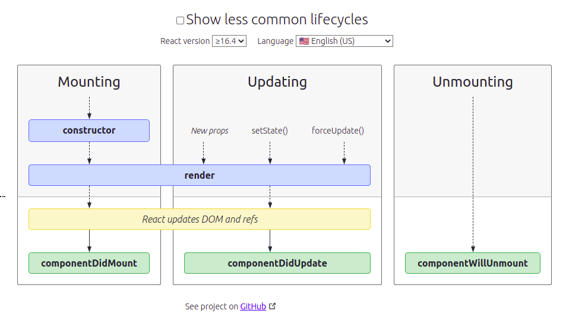

# 3. React basics - Part -2

Created: January 22, 2022 3:01 PM

## Card Component 🎴

First we will create **components** folder inside the **src** folder.

Then inside the components create a `card-list` folder which will contain the `.jsx` and `css` file for our card-list component. And similarly a `card` component folder containing one jsx ans css file.

( A final folder structure screenshot is to taken → Pending )

Lest understand how to code these components.

---

One important thing about component is that they take `props` which is nothing but the parameter which is special. 

Q. Can we name props to something we want ?

**card-list.component.jsx → Basic code**

```jsx
import React from 'react';
import './card-list.style.css';
export const CardList = props => {
	console.log(props);
	return <div> { props.children } </div>;
}
```

**App.js render() → Basic code**

```jsx
render() {
return (
	<div className="App">
		<CardList name='Pranay'><h1>Pranay Raj</h1></CardList>
	</div>
)}
```

**Props** as written above is a special parameter. It has **children** method which access the **data inside the component tag**.

In above code, this is **<h1>Pranay Raj</h1>.**

And **props** is the whole object which has **name method,** which is a custom method and the **children method** which is the inbuilt method.

---

In next step, we will move to our actual **Monster App.**

We added styling inside the **card-list.style.css .** And card-list is basically a grid. and we move all our monster name and id data inside the CardList tag and In the CardList Component we added a class to our div , **.card-list** for styling.

```jsx
<div className="App">
    <CardList>
    { this.state.monsters.map(monster => {
        return (<h1 key = { monster.id }> { monster.name}</h1>)
      }) 
    }
    </CardList>
</div>
```

**Problem** → We don’t want to give data directly to the CardList tag inside the App.js.

**Solution** → We will pass them as parameter.

And We will code our **Card Component.** This component along with card-list component will handle all the data and that’s what we want.

```jsx
// render() function from App.js
render() {
  return (
    <div className="App">
      <CardList monsters={this.state.monsters}></CardList>
    </div>
  );
}
```

```jsx
import React from "react";
import "./card-list.style.css";
import {Card} from '../card/card.component'
export const CardList = (props) => {
  return (
    <div className="card-list" >
      { props.monsters.map(monster => {
        return <Card key={monster.id} monster={monster}></Card>;
      })
      }
    </div>
  );
};
```

**Card Component**

```jsx
import React from "react";
import './card.style.css';

export const Card = props => (
    <div className="card-container">
        
        <h1>{props.monster.name}</h1>
        <p>{ props.monster.email }</p>
    </div>
)
```

**Notice** → We had used **[robohash.org](http://robohash.org)** to get **random** images based on number and co-incidentally our monster id are also number.

**See** that in Card Component how we had written **Card** function  

---

**State Vs Props** → At the first place in our app.js we created a state.

Then we changed the state in the componentDidMount Life Cycle Method. And we passed that state as props in our Card List Component and also used that prop to pass a further prop in Card Component.

**First of All** → Breaking long piece of code is always beneficial in multiple ways. So We have to understand this thing that where we can break down the thing into simpler components.

Now coming back to previous topic, We created a state just once and can set state further multiple time and can pass that state. **This shows the uni-directional data flow.**

---

## Search Field Component

Before starting with this Component, we will study about **React Events and some other concepts.**

- **onChange** event →
    
    This is a synthetic event in React. This onChange is in JSX , which is different from onchange in JS.
    
- **Synthetic Event** →
    
    React intercept the actual event and tells the React state that It encountered a event and ask for a command , that may be,  to change a state.
    
- **render() and setState()** →
    
    Whenever state change , the render function is called. Hence we cannot directly call setState function inside the render function otherwise it will error.
    
    However, we can call the setState function inside the onChange event.
    
    ```jsx
    onChange = {e => {
    	this.setState({ name : 'raj' });
    }}
    ```
    
- **Asynchronous nature of JS in React**
    
    Q. Lets say we change the state using setState function but what if we will to console.log() our state just after changing ?
    
    **Wrong Method:**
    
    ```jsx
    onChange = {e => {
    	this.setState({ name : 'raj' });
    	console.log(this.state);
    }}
    ```
    
    **Problem:**
    
    Here state will logged before it is changed, And hence it will be one step behind.
    
    **Solution and the Correct method**:
    
    ```jsx
    onChange = {e => {
    	this.setState({ name : 'raj' }, () => console.log(this.state));
    }}
    ```
    
    Now the state will logged just after the change.
    

**`SearchField State` →** we added a searchField state in App.js And filter out the monsters that include that searchField.

```jsx
this.state = {
      monsters: [],
      searchField: "",
    };
```

```jsx
render() {
    let { monsters, searchField } = this.state;
    const fiteredMonsters = monsters.filter((monster) => {
      return monster.name.toLowerCase().includes(searchField.toLowerCase());
    });
    return (
      <div className="App">
        <SearchBox
          placeholder="Search Monster"
          handleChange={(e) => this.setState({ searchField: e.target.value })}
        />
        <CardList monsters={fiteredMonsters}></CardList>
      </div>
    );
  }
```

Also , we created a Search Box Component 

```jsx
export const SearchBox = ({ placeholder, handleChange }) => (
  <input
    className="search"
    type="search"
    placeholder={placeholder}
    onChange={handleChange}
  />
);
```

Q. Why we added this searchField State to App.js but not to Search Box Component ?

Ans. Due to uni-directional data flow, if we added the search field state to the search box component, it will not be possible to use this search field and filter the monsters array in app.js

---

## Class Methods and Arrow Function

If we define a new class method , `handleChange` and call it in SearchBox Tag.

```jsx
handleChange(e) {
    this.setState({ searchField: e.target.value });
} // A class method
// Inside the SearchBox tag
handleChange={this.handleChange}
```

**Problem :** This will give us an error. Javascript is unable to identify the **this.setState** inside the handleChange. 

**Reason :** If we are using normal function, it is needed to explicitly define the context of the function. Here this.setState inside the handleChange is not getting binded automatically to `this` context.

**Solution :** Inside the constructor of this Class,  we have bind handleChange to *this* context.

```jsx
this.handleChange = this.handleChange.bind(this);
```

**Simple Solution : Use arrow function** , Yes Arrow function automatically bind to the scope needed or called inside the function declaration. Like here , it will automatically bind the handleChange method to `this` context.

```jsx
handleChange = e => {
this.setState({ searchField = e.target.value })
}
```

See How `Arrow Function` makes our life easy. 😇

---

## Deploying on the Github Pages

Make a repository first. Then run these commands:

```bash
git remote add origin [github repo link]
npm add gh-pages
```

Next go to the **package.json** file, add a new field

```jsx
"homepage": "https://masterpranay1.github.io/Monster-Rolodex",
```

Also add two scripts, predeploy and deploy

```jsx
"scripts": {
    "start": "react-scripts start",
    "build": "react-scripts build",
    "test": "react-scripts test",
    "eject": "react-scripts eject",
    "predeploy" : "npm run build",
    "deploy" : "gh-pages -d build"
}
```

Now run , 

```bash
npm deploy
```

This command will run the `predeploy` script and then github-pages will deploy.

Now stage the changes and commit the changes made to file.

```bash
git add .
git commit -m "adding files for uploading to github"
```

After this, push the code to gh-pages.

```bash
git push origin master
```

**Github page created a new branch** called gh-pages and all the build code is inside the **gh-pages branch** and the actual code lies inside the **master branch**. 

---

## React using Vanilla Javascript

First we will create a **html page** and add the basic template.

Then include the **react and react-dom** CDN from unpkg. 

We will write the internal javascript.

```html
<script> 
	const App = () => {
		return React.createElement(
			"div", {class:"test"}, 
			React.createElement('h1', {}, 'React is rendered')
		);
	};
	ReactDOM.render(
	React.createElement(App), document.getElementById('root')
	);
</script>
```

Moving a step further ,

```jsx
const Person = () => {
	return React.createElement('div', {}, [
		React.createElement('h1', {}, 'Pranay'),
		React.createElement('p', {}, 'Developer')
	]);
};
const Person2 = props => {
	return React.createElement('div', {}, [
		React.createElement('h1', {}, props.name),
		React.createElement('p', {}, props.occupation)
	]);
};
const App = () => {
	return React.createElement(
		"div", }, [ 
		React.createElement('h1', {}, 'React is rendered'),
		React.createElement(Person),
		React.createElement(Person),
		React.createElement(Person),
		React.createElement(Person2, { name: ‘pranay’, occupation: ‘developer’ });
	]);
};
```

---

## Updating our React Version

In `package.json` , include the `^` icon in version of react , react-dom and react script.

```jsx
"react": "^17.0.2",
"react-dom": "^17.0.2",
"react-scripts": "5.0.0"
```

Now when we run, `npm list react react-dom react-scripts` , It will list the version of these files and to update them to latest version , `npm update`.

One different between `npm` and `yarn` is we can run `npm audit fix` but we have to do it explicitly to each required file in yarn.

---

## Asynchronous setState

In tutorial it was taught that we can write set state in two formats, one is the **normal way( passing an object )** we were writing while another way we have to pass a **anonymous function**.

```jsx
this.setState((prevState, prevProps) => {
return { // what ever you want }
}); 
```

`prevState` is the state before changing it. Instead of **this.state** , we can write prevState.

`prevProps` is what props passed to the class component. Instead of **this.props** , we can write prevState.

Now how to access the props passed to the class component normally.

**this.props.argumentName** → In this way we can access.

And one special thing if we want to access the props inside the constructor, we have to pass props to the constructor and the super functions.

But we can always access the props outside the constructor.

And Most important thing **We cannot edit the props inside the class component. This is just a read-only property.**

**Problem :** Apart from this `setState` work in asynchronous manner. so checking for state change just after the changing it won’t work.

**Solution : Second Argument to setState**

```jsx
this.setState({}, () => {
	console.log(this.state.whatChanges);
});
```

Also Calling the constructor is not necessary. We can just define state and call the props and rest all things will work as usual.

```jsx
class App extends React.Component {
state = {
	key : this.props.increment + 1
}
render() {
...
}
}
```

---

## Life Cycle Methods

In our Monster app, we used `componentDidMount` Life Cycle method. Now we will understand what are Life Cycle Methods and specially when they are called .

Lifecycle methods are **special methods built into React, used to operate on components throughout their duration in the DOM**.

There are **4** LIfe Cycle Method (taught) →

1. ComponentDidMount
2. ComponentDidUpdate
3. ShouldComponentUpdate
4. ComponentWillUnmount

Lets first Know how calling is done in Class Component →



First **Constructor** is called then **render** function is called. Then **componentDidMount** is called.

If There is any update in state or new props is passed, React first call the **render** function then **componentDidUpdate.**

Now **shouldComponentUpdate** is a even special method. It is given a return value as **Boolean** ( true, false ). Well This method is also called after a change but **before the render method is called**. If value returned is **true, render** method will be called otherwise it will not be called. 

Now Last one is the **componentWillUnmount,** this runs as soon as the respective **class component** is being stop rendered. In other words, it clear all the garbage left after the class component itself stop rendering.

---

## Function Vs Class Component

Functional components are the best type of component to render if you **don't need access to state or lifecycle methods!** It has benefits of being easy to test, easier to read, and easier to write!

Class component are the best when we need to maintain a state or any lifecycle method.

---

# This section ends here 😀